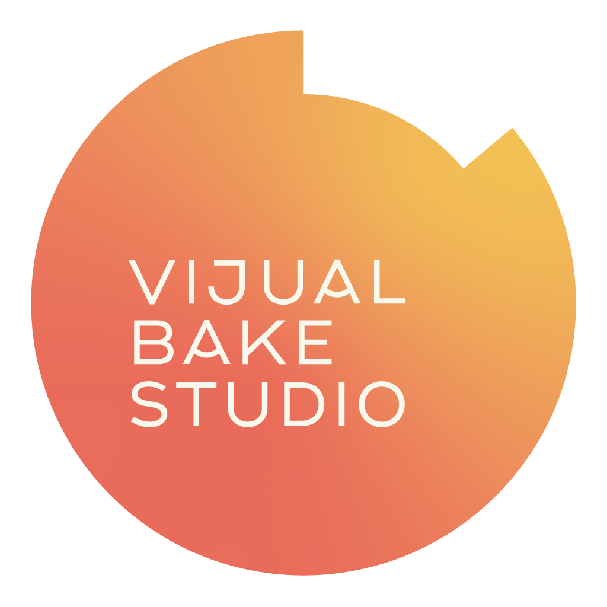

# Bake Studio



Temporal Sampler TS-1.

Bake Studio is an authoring tool for VJs and visual artists who need the fluidity of AI-interpolated motion with the precision of a rhythmic sampler. It prepares raw footage for live playback by baking it into `.vjb` bundles with high-FPS media, marker transport metadata, and deterministic playback behavior.

The goal is simple: do the expensive temporal work ahead of time, then perform with media that can jump, freeze, reverse, loop, and hit exact moments without falling apart under pressure.

## Why Bake Studio

Standard video players are not designed for aggressive rhythmic seeking, reverse traversal, or repeated segment jumps at club tempo. Bake Studio solves that by precomputing temporal motion and exporting a playback-oriented bundle instead of a generic video file.

- Temporal super-resolution: turn 30 FPS footage into 120 or 240 FPS using RIFE v4.x
- Zero-latency teleporting: prepare media for codecs and containers suited to realtime playback
- Smart indexing: define markers with entry behavior such as mode, direction, speed, and easing
- Hardware-aware baking: prefer `fp16` paths on Apple Silicon and modern GPUs where available

## Core Concepts

### Source vs Baked Timeline

Bake Studio works with two frame spaces:

- `source frame space`: the original clip where the user places markers
- `baked frame space`: the interpolated export that becomes the authoritative playback timeline

This matters because VJB playback uses baked timing as the source of truth. Internally, Bake Studio authors markers in source space and rewrites them during export so that `markers[].frame` matches `media.primaryVideo.frameCount` and `media.primaryVideo.fps`.

### The `.vjb` Bundle

A VJB bundle is a ZIP-based package built around:

- `manifest.json` at archive root
- `media/master.mov` or equivalent primary playback media
- optional thumbnails, proxies, analysis, and extension assets

Bake Studio targets the public VJB spec from [`yaneczech/vjb-format`](https://github.com/yaneczech/vjb-format).

## Core Features

### The Engine

- AI interpolation via `rife-ncnn-vulkan`
- Optional Real-ESRGAN upscale before interpolation
- Export targets:
- `HAP Q` for broad realtime playback workflows
- `ProRes 422` and `ProRes 4444` for Apple-centric and alpha-preserving workflows
- Manifest generation with authoritative playback timing and `media.primaryVideo.alpha`

### The Authoring UI

- Timeline scrubbing with marker placement
- Marker inspector for per-marker behavior
- Keyboard hotkeys `1-9` for fast index dropping
- Rhythm-oriented workflow for beat-driven loop authoring

### Playback Intent

Each marker can carry entry state such as:

- `mode`
- `direction`
- `speed`
- `easing`

That gives the playback tool enough information to jump into a segment with defined transport intent, while still allowing runtime overrides in performance software.

## Architecture

The repo is structured as a desktop workspace:

- `apps/studio`: Tauri 2 + SolidJS desktop app
- `packages/project-model`: internal authoring model and source-to-baked frame mapping
- `packages/vjb-core`: VJB manifest types, export conversion, and hard-rule validation
- `packages/media-pipeline`: bake job orchestration for probe, interpolate, encode, and package steps
- `packages/shared`: shared utility types

The important boundary is:

- authoring data lives in the Bake Studio project model
- export data lives in the VJB manifest model
- conversion between them is explicit and deterministic

## Status

This repository is currently an early scaffold. The current implementation includes:

- Tauri + SolidJS workspace setup
- initial Bake Studio project model
- source-to-baked frame mapping utilities
- VJB manifest conversion
- VJB hard-rule validation stubs

Planned next steps:

- schema-based manifest validation against `vjb-format`
- media probe and ingest pipeline
- proxy and thumbnail generation
- interpolation and encode pipeline
- timeline and marker editing UI

## Development

Requirements:

- Node.js 22+
- Rust toolchain
- Tauri prerequisites for your platform

Install and run:

```bash
npm install
npm run dev
```

Useful commands:

```bash
npm run typecheck
npm run build
cd apps/studio/src-tauri && cargo check
```

## Format Notes

Bake Studio follows the VJB rules that matter most for playback interoperability:

- `manifest.json` is the root manifest file
- `media.primaryVideo.path` must stay archive-relative
- `media.primaryVideo.frameCount` and `media.primaryVideo.fps` are authoritative
- exported marker `frame` values are written in baked frame space
- `media.primaryVideo.alpha` is the authoritative playback alpha flag

## Community

Bake Studio is being developed as part of the wider VJB tooling family.

Areas where feedback is especially useful:

- live VJ playback workflows
- marker ergonomics and beat indexing
- codec and container interoperability
- Apple Silicon and Vulkan bake performance

## License

Bake Studio is distributed under the `Bake Studio Free Use No-Resale License 1.0`.

In practical terms:

- you may use the software for free, including for commercial work and profit-generating output
- you may modify and share it
- you may not sell the software itself or resell copies of it to third parties
- you may charge for services performed with it, as long as the software itself remains free

This is a source-available license, not an OSI open-source license.

See also: [LICENSE-FAQ.md](/Users/janjanecek/Documents/GitHub/VJB/Bake%20Studio/LICENSE-FAQ.md)

Developed by Jan Janecek.
